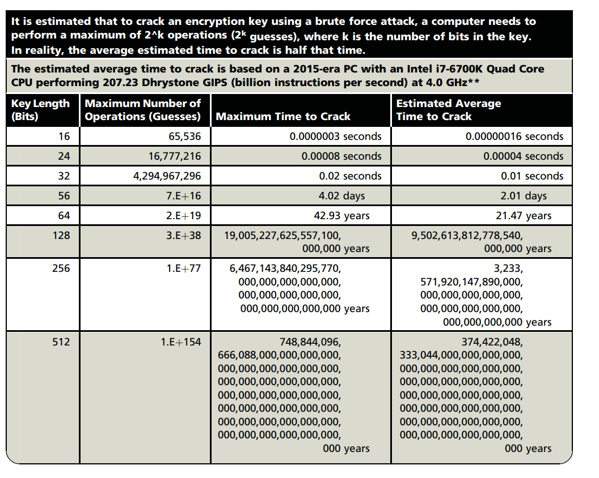
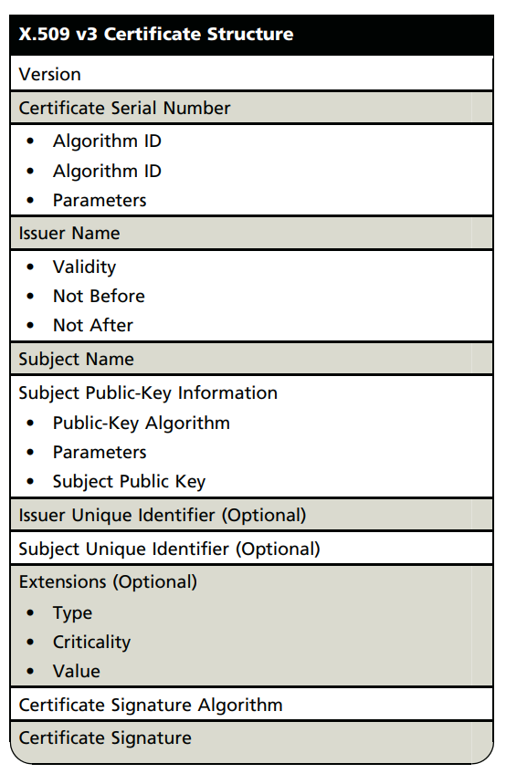
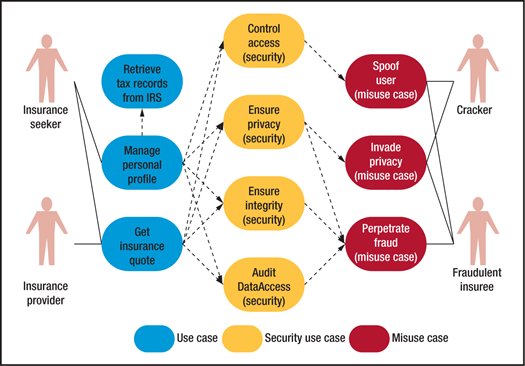
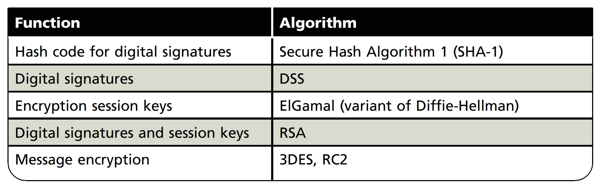

# Cryptography

### **Cryptography** 

### Introduction to Cryptography. 

The science of encryption, known as cryptology, encompasses cryptography and cryptanalysis. Cryptography comes from the Greek words kryptos, meaning “hidden,” and graphein, meaning “to write,” and involves making and using codes to secure messages. Cryptanalysis involves cracking or breaking encrypted messages back into their unencrypted origins. Cryptography uses mathematical algorithms that are usually known to all. After all, it’s not the knowledge of the algorithm that protects the encrypted message, it’s the knowledge of the key—a series of characters or bits injected into the algorithm along with the original message to create the encrypted message. An individual or system usually encrypts a plaintext message into ciphertext, making it unreadable to unauthorized people—those without the key needed to decrypt the message back into plaintext, where it can be read and understood. The field of cryptology is so vast that it can fill many volumes. This textbook provides only a general overview of cryptology and some specific information about a few cryptographic tools. In the early sections of this chapter, you will learn the background of cryptology as well as key concepts in cryptography and common cryptographic tools. In later sections, you will learn about common cryptographic protocols and some of the attack methods used against cryptosystems.

### Foundations of Cryptology 

Cryptology has an extensive, multicultural history. People have been making, using, and breaking codes for thousands of years, and they will not stop any time soon. Table 8-1 provides a brief overview of the history of cryptosystems.

Today, many common IT tools use embedded encryption technologies to protect sensitive information within applications. For example, all the popular Web browsers use built-in encryption features to enable secure e-commerce, such as online banking and Web shopping.

Since World War II, there have been restrictions on the export of cryptosystems, and they continue today, as you saw in Figure 3-4. In 1992, encryption tools were officially listed as Auxiliary Military Technology under the Code of Federal Regulations: International Traffic in Arms Regulations.1 These restrictions are due in part to the role cryptography played in World War II, and the belief of the American and British governments that the cryptographic tools they developed were far superior to those in lesser developed countries. As a result, both governments believe such countries should be prevented from using cryptosystems to communicate potential terroristic activities or gain an economic advantage.

**Terminology**

To understand the fundamentals of cryptography, you must know the meanings of the following terms:

* Algorithm: The mathematical formula or method used to convert an unencrypted message into an encrypted message. This sometimes refers to the programs that enable the cryptographic processes.
* Bit stream cipher: An encryption method that involves converting plaintext to ciphertext one bit at a time.
* Block cipher: An encryption method that involves dividing the plaintext into blocks or sets of bits and then converting the plaintext to ciphertext one block at a time.
* Cipher: When used as a verb, the transformation of the individual components (characters, bytes, or bits) of an unencrypted message into encrypted components or vice versa (see decipher and encipher); when used as a noun, the process of encryption or the algorithm used in encryption, and a term synonymous with cryptosystem.
* Ciphertext or cryptogram: The unintelligible encrypted or encoded message resulting from an encryption.
* Code: The process of converting components (words or phrases) of an unencrypted message into encrypted components.
* Decipher: See Decryption.
* Decryption: The process of converting an encoded or enciphered message (ciphertext) back to its original readable form (plaintext). Also referred to as deciphering.
* Encipher: See Encryption.
* Encryption: The process of converting an original message (plaintext) into a form that cannot be used by unauthorized individuals (ciphertext). Also referred to as enciphering.
* Key or cryptovariable: The information used in conjunction with the algorithm to create the ciphertext from the plaintext; it can be a series of bits used in a mathematical algorithm or the knowledge of how to manipulate the plaintext. Sometimes called a cryptovariable.
* Keyspace: The entire range of values that can be used to construct an individual key.
* Link encryption: A series of encryptions and decryptions between a number of systems, wherein each system in a network decrypts the message sent to it and then reencrypts the message using different keys and sends it to the next neighbor. This process continues until the message reaches the final destination.
* Plaintext or cleartext: The original unencrypted message that is encrypted and is the result of successful decryption.
* Steganography: The process of hiding messages; for example, hiding a message within the digital encoding of a picture or graphic so that it is almost impossible to detect that the hidden message even exists.
* Work factor: The amount of effort (usually expressed in units of time) required to perform cryptanalysis on an encoded message.

### &#x20;

### Cryptographic Algorithms & Encryption. 

In general, cryptographic algorithms are often grouped into two broad categories—symmetric and asymmetric—but in practice, today’s popular cryptosystems use a combination of both algorithms. Symmetric and asymmetric algorithms are distinguished by the types of keys they use for encryption and decryption operations.

**Symmetric Encryption**

Encryption methodologies that require the same secret key to encipher and decipher the message are performing private-key encryption or symmetric encryption. Symmetric encryption methods use mathematical operations that can be programmed into extremely fast computing algorithms so that encryption and decryption are executed quickly, even by small computers. As you can see in Figure 8-5, one of the challenges is that both the sender and the recipient must have the secret key. Also, if either copy of the key falls into the wrong hands, messages can be decrypted by others and the sender and intended receiver may not know a message was intercepted. The primary challenge of symmetric key encryption is getting the key to the receiver, a process that must be conducted out of band to avoid interception. In other words, the process must use a channel or band other than the one carrying the ciphertext.

There are a number of popular symmetric encryption cryptosystems. One of the most widely known is the Data Encryption Standard (DES); it was developed by IBM and is based on the company’s Lucifer algorithm, which uses a key length of 128 bits. As implemented, DES uses a 64-bit block size and a 56-bit key. DES was adopted by NIST in 1976 as a federal standard for encryption of nonclassified information, after which it became widely employed in commercial applications. DES enjoyed increasing popularity for almost 20 years until 1997, when users realized that a 56-bit key size did not provide acceptable levels of security. In 1998, a group called the Electronic Frontier Foundation (www.eff.org) used a specially designed computer to break a DES key in just over 56 hours. Since then, it has been theorized that a dedicated attack supported by the proper hardware (not necessarily a specialized computer) could break a DES key in less than a day.

Triple DES (3DES) was created to provide a level of security far beyond that of DES. 3DES was an advanced application of DES, and while it did deliver on its promise of encryption strength beyond DES, it soon proved too weak to survive indefinitely—especially as computing power continued to double every 18 months. Within just a few years, 3DES needed to be replaced.

The successor to 3DES is the Advanced Encryption Standard (AES). AES is a federal information processing standard (FIPS) that specifies a cryptographic algorithm used within the U.S. government to protect information in federal agencies that are not part of the national defense infrastructure. (Agencies that are considered a part of national defense use more secure methods of encryption, which are provided by the National Security Agency.) The requirements for AES stipulate that the algorithm should be unclassified, publicly disclosed, and available royalty-free worldwide. AES was developed to replace both DES and 3DES.

While 3DES remains an approved algorithm for some uses, its expected useful life is limited. Historically, cryptographic standards approved by FIPS have been adopted on a voluntary basis by organizations outside government entities. The AES selection process involved cooperation between the U.S. government, private industry, and academia from around the world. AES was approved by the Secretary of Commerce as the official federal governmental standard on May 26, 2002.

AES implements a block cipher called the Rijndael Block Cipher with a variable block length and a key length of 128, 192, or 256 bits. Experts estimate that the special computer used by the Electronic Frontier Foundation to crack DES within a couple of days would require approximately 4,698,864 quintillion years (4,698,864,000,000,000,000,000) to crack AES. To learn more about AES, see the nearby Technical Details feature.

>)

**Asymmetric Encryption**

While symmetric encryption systems use a single key both to encrypt and decrypt a message, asymmetric encryption uses two different but related keys. Either key can be used to encrypt or decrypt the message. However, if key A is used to encrypt the message, only key B can decrypt it; if key B is used to encrypt a message, only key A can decrypt it. Asymmetric encryption can be used to provide elegant solutions to problems of secrecy and verification. This technique has its greatest value when one key is used as a private key, which means it is kept secret (much like the key in symmetric encryption) and is known only to the owner of the key pair. The other key serves as a public key, which means it is stored in a public location where anyone can use it. For this reason, the more common name for asymmetric encryption is public-key encryption.

While symmetric encryption systems use a single key both to encrypt and decrypt a message, asymmetric encryption uses two different but related keys. Either key can be used to encrypt or decrypt the message. However, if key A is used to encrypt the message, only key B can decrypt it; if key B is used to encrypt a message, only key A can decrypt it. Asymmetric encryption can be used to provide elegant solutions to problems of secrecy and verification. This technique has its greatest value when one key is used as a private key, which means it is kept secret (much like the key in symmetric encryption) and is known only to the owner of the key pair. The other key serves as a public key, which means it is stored in a public location where anyone can use it. For this reason, the more common name for asymmetric encryption is public-key encryption.

Consider the following example, as illustrated in Figure 8-6. Alex at XYZ Corporation wants to send an encrypted message to Rachel at ABC Corporation. Alex goes to a public-key registry and obtains Rachel’s public key. Remember that the foundation of asymmetric encryption is that the same key cannot be used both to encrypt and decrypt the same message. So, when Rachel’s public key is used to encrypt the message, only her private key can be used to decrypt the message; that private key is held by Rachel alone. Similarly, if Rachel wants to respond to Alex’s message, she goes to the registry where Alex’s public key is held and uses it to encrypt her message, which of course can only be read by Alex’s private key. This approach, which keeps private keys secret and encourages the sharing of public keys in reliable directories, is an elegant solution to the key management problems of symmetric key applications.

Asymmetric algorithms are one-way functions, meaning they are simple to compute in one direction, but complex to compute in the opposite direction. This is the foundation of public-key encryption. It is based on a hash value, which is calculated from an input number using a hashing algorithm, as you learned earlier in this chapter. This hash value is essentially a summary of the original input values. It is virtually impossible to derive the original values without knowing how they were used to create the hash value. For example, if you multiply 45 by 235, you get 10,575. This is simple enough. But if you are simply given the number 10,575, can you determine which two numbers were multiplied to produce it?

Now assume that each multiplier is 200 digits long and prime. The resulting multiplicative product could be up to 400 digits long. Imagine the time you’d need to factor out those numbers. There is a shortcut, however. In mathematics, it is known as a trapdoor (which is different from the software trapdoor). A mathematical trapdoor is a “secret mechanism that enables you to easily accomplish the reverse function in a one-way function.”5 With a trapdoor, you can use a key to encrypt or decrypt the ciphertext, but not both, thus requiring two keys. The public key becomes the true key, and the private key is derived from the public key using the trapdoor.

One of the most popular public-key cryptosystems is RSA, whose name is derived from Rivest-Shamir-Adleman, the algorithm’s developers. The RSA algorithm was the first publickey encryption algorithm developed (in 1977) and published for commercial use. It is very popular and has been embedded in essentially all widely available Web browsers to provide security for e-commerce applications. The patented RSA algorithm has become the de facto standard for public-use encryption applications.

The problem with asymmetric encryption, as shown earlier in Figure 8-6, is that holding a single conversation between two parties requires four keys. Moreover, if four organizations want to exchange communications, each party must manage its private key and four public keys. In such scenarios, determining which public key is needed to encrypt a particular message can become a rather confusing problem, and with more organizations in the loop, the problem expands. This is why asymmetric encryption is sometimes regarded by experts as inefficient. Compared with symmetric encryption, asymmetric encryption is also not as efficient in terms of CPU computations. Consequently, hybrid systems, such as those described later in this chapter in the “public key infrastructure (PKI)” section, are more commonly used than pure asymmetric systems.

>)

**Encryption Key Size**

When deploying ciphers, it is important for users to decide on the size of the cryptovariable or key, because the strength of many encryption applications and cryptosystems is measured by key size. How exactly does key size affect the strength of an algorithm? Typically, the length of the key increases the number of random guesses that have to be made in order to break the code. Creating a larger universe of possibilities increases the time required to make guesses, and thus a longer key directly influences the strength of the encryption.

It may surprise you to learn that when it comes to cryptosystems, the security of encrypted data is not dependent on keeping the encrypting algorithm secret. In fact, algorithms should be published and often are, to enable research to uncover their weaknesses. The security of any cryptosystem depends on keeping some or all elements of the cryptovariable(s) or key(s) secret, and effective security is maintained by manipulating the size (bit length) of the keys and following proper procedures and policies for key management.

For a simple example of how key size is related to encryption strength, suppose you have an algorithm that uses a three-bit key. You may recall from earlier in the chapter that keyspace is the range from which the key can be drawn. Also, you may recall that in binary notation, three bits can be used to represent values from 000 to 111, which correspond to the numbers 0 to 7 in decimal notation and thus provide a keyspace of eight keys. This means an algorithm that uses a three-bit key has eight possible keys; the numbers 0 to 7 in binary are 000, 001, 010, 011, 100, 101, 110, and 111. If you know how many keys you have to choose from, you can program a computer to try all the keys in an attempt to crack the encrypted message.

The preceding statement makes a few assumptions: (1) you know the algorithm, (2) you have the encrypted message, and (3) you have time on your hands. It is easy to satisfy the first criterion. The encryption tools that use DES can be purchased over the counter. Man of these tools are based on encryption algorithms that are standards, as is DES itself, and therefore it is relatively easy to get a cryptosystem based on DES that enables you to decrypt an encrypted message if you possess the key. The second criterion requires the interception of an encrypted message, which is illegal but not impossible. As for the third criterion, the task required is a brute force attack, in which a computer randomly or sequentially selects possible keys of the known size and applies them to the encrypted text or a piece of the encrypted text. If the result is plaintext—bingo! But, as indicated earlier in this chapter, it can take quite a long time to exert brute force on more advanced cryptosystems. In fact, the strength of an algorithm is determined by how long it takes to guess the key.

When it comes to keys, how big is big? At the beginning of this section, you learned that a three-bit system has eight possible keys. An eight-bit system has 256 possible keys. If you use a 24-bit key, which is puny by modern standards, you have almost 16.8 million possible keys. Even so, a modern PC, such as the one described in Table 8-5, could discover this key in mere seconds. But, as the table shows, the amount of time needed to crack a cipher by guessing its key grows exponentially with each additional bit.

One thing to keep in mind is that even though the estimated time to crack grows rapidly with respect to the number of bits in the encryption key and the odds of cracking seem insurmountable at first glance, Table 8-5 doesn’t account for the fact that high-end computing power has increased and continues to be more accessible. Making this even more challenging is the use of graphics processing units (GPUs) found in video cards. These powerful processors can be programmed to perform cryptanalysis calculations, usually at a faster rate than the computer’s primary CPU. Therefore, even the once-standard 56-bit encryption can’t stand up anymore to brute force attacks by personal computers, especially if multiple computers are used together to crack these keys. Each additional computer reduces the amount of time needed. Two computers can divide the keyspace—the entire set of possible combinations of bits that can be the cryptovariable or key—and crack the key in approximately half the time, and so on. Thus, 43 computers can crack a 64-bit key in just under one year; 12 times as many computers would do it in just under a month. This means people who have access to multiple systems or grid computing environments can radically speed up brute force key-breaking efforts. However, an even greater concern is the ease with which you can read messages encrypted by what appear to be uncrackable algorithms if you have the key. Key management (and password management) is the most critical aspect of any cryptosystem in protecting encrypted information, and is even more important in many cases than key strength.

Why, then, do encryption systems such as DES incorporate multiple elements or operations? Consider this: If a cryptosystem uses the same operation (XOR, substitution, or transposition) multiple consecutive times, it gains no additional benefit. For example, using a substitution cipher and substituting B for A, then R for B, and then Q for R, has the same effect as substituting Q for A. Similarly, by transposing a character in position 1, then position 4, then position 3, a cryptosystem could more easily have transposed the character from position 1 to position 3. There is no net advantage for sequential operations unless each subsequent operation is different. Therefore, to substitute, then transpose, then XOR, then substitute again, the cryptosystem will have dramatically scrambled, substituted, and recoded the original plaintext with ciphertext, which the cryptosystem hopes is unbreakable without the key.

### Cryptographic Tools. 

The ability to conceal the contents of sensitive messages and verify the contents of messages and the identities of their senders can be important in all areas of business. To be useful, these cryptographic capabilities must be embodied in tools that allow IT and information security practitioners to apply the elements of cryptography in the everyday world of computing. This section covers some of the widely used tools that bring the functions of cryptography to the world of information systems.

Public key infrastructure (PKI) systems are based on public-key cryptosystems and include digital certificates and certificate authorities (CAs). Digital certificates allow the PKI components and their users to validate keys and identify key owners. (Digital certificates are explained in more detail later in this chapter.) PKI systems and their digital certificate registries enable the protection of information assets by making verifiable digital certificates readily available to business applications. This, in turn, allows the applications to implement several key characteristics of information security and integrate these characteristics into the following business processes across an organization:

* **Authentication:** Individuals, organizations, and Web servers can validate the identity of each party in an Internet transaction.
* **Integrity:** Content signed by the certificate is known not to have been altered while in transit from host to host or server to client.
* **Privacy:** Information is protected from being intercepted during transmission.
* **Authorization:** The validated identity of users and programs can enable authorization rules that remain in place for the duration of a transaction; this reduces overhead and allows for more control of access privileges for specific transactions.
* **Nonrepudiation:** Customers or partners can be held accountable for transactions, such as online purchases, which they cannot later dispute.

A typical PKI solution protects the transmission and reception of secure information by integrating the following components:

* A certificate authority (CA), which issues, manages, authenticates, signs, and revokes users’ digital certificates. These certificates typically contain the user name, public key, and other identifying information.
* A registration authority (RA), which handles certification functions such as verifying registration information, generating end-user keys, revoking certificates, and validating user certificates, in collaboration with the CA.
* Certificate directories, which are central locations for certificate storage that provide a single access point for administration and distribution.
* Management protocols, which organize and manage communications among CAs, RAs, and end users. This includes the functions and procedures for setting up new users, issuing keys, recovering keys, updating keys, revoking keys, and enabling the transfer of certificates and status information among the parties involved in the PKI’s area of authority.
* Policies and procedures, which assist an organization in the application and management of certificates, in the formalization of legal liabilities and limitations, and in actual business use.

Common implementations of PKI include systems that issue digital certificates to users and servers, directory enrollment, key issuing systems, tools for managing key issuance, and verification and return of certificates. These systems enable organizations to apply an enterprisewide solution that allows users within the PKI’s area of authority to engage in authenticated and secure communications and transactions.

The CA performs many housekeeping activities regarding the use of keys and certificates that are issued and used in its zone of authority. Each user authenticates himself or herself with the CA. The CA can issue new or replacement keys, track issued keys, provide a directory of public-key values for all known users, and perform other management activities. When a private key is compromised or the user loses the privilege of using keys in the area of authority, the CA can revoke the user’s keys. The CA periodically distributes a certificate revocation list (CRL) to all users. When important events occur, specific applications can make a real-time request to the CA to verify any user against the current CRL.

The issuance of certificates and their keys by the CA enables secure, encrypted, nonrepudiable e-business transactions. Some applications allow users to generate their own certificates and keys, but a key pair generated by the end user can only provide nonrepudiation, not reliable encryption. A central system operated by a CA or RA can generate cryptographically strong keys that are considered independently trustworthy by all users, and can provide services for users such as private-key backup, key recovery, and key revocation.

The strength of a cryptosystem relies on both the raw strength of its key’s complexity and the overall quality of its key management security. PKI solutions can provide several mechanisms for limiting access and possible exposure of the private keys. These mechanisms include password protection, smart cards, hardware tokens, and other hardware-based key storage devices that are memory-capable, like flash memory or PC memory cards. PKI users should select the key security mechanisms that provide an appropriate level of key protection for their needs. Managing the security and integrity of the private keys used for nonrepudiation or the encryption of data files is critical to successfully using the encryption and nonrepudiation services within the PKI’s area of trust.

**Digital Signatures**

Digital signatures were created in response to the rising need to verify information transferred via electronic systems. Asymmetric encryption processes are used to create digital signatures. When an asymmetric cryptographic process uses the sender’s private key to encrypt a message, the sender’s public key must be used to decrypt the message. When the decryption is successful, the process verifies that the message was sent by the sender and thus cannot be refuted. This process is known as nonrepudiation, and is the principle of cryptography that underpins the authentication mechanism collectively known as a digital signature. Digital signatures, therefore, are encrypted messages that can be mathematically proven as authentic.

The management of digital signatures is built into most Web browsers. For example, the digital signature management screen in Internet Explorer is shown in Figure 8-7. In general, digital signatures should be created using processes and products that are based on the Digital Signature Standard (DSS). When processes and products are certified as DSS compliant, they have been approved and endorsed by U.S. federal and state governments, as well as by many foreign governments, as a means of authenticating the author of an electronic document.

DSS algorithms can be used in conjunction with the sender’s public and private keys, the receiver’s public key, and the Secure Hash Standard to quickly create messages that are both encrypted and nonrepudiable. This process first creates a message digest using the hash algorithm, which is then input into the digital signature algorithm along with a random number to generate the digital signature. The digital signature function also depends on the sender’s private key and other information provided by the CA. The resulting encrypted message contains the digital signature, which can be verified by the recipient using the sender’s public key.

**Digital Certificates**

As you learned earlier in this chapter, a digital certificate is an electronic document or container file that contains a key value and identifying information about the entity that controls the key. The certificate is often issued and certified by a third party, usually a certificate authority. A digital signature attached to the certificate’s container file certifies the file’s origin and integrity. This verification process often occurs when you download or update software via the Internet. For example, the window in Figure 8-8 shows that the downloaded files do come from the purported originating agency, Amazon.com, and thus can be trusted.

Unlike digital signatures, which help authenticate the origin of a message, digital certificates authenticate the cryptographic key that is embedded in the certificate. When used properly, these certificates enable diligent users to verify the authenticity of any organization’s certificates. This process is much like what happens when the Federal Deposit Insurance Corporation (FDIC) issues its logo to assure customers that a bank is authentic. Different client-server applications use different types of digital certificates to accomplish their assigned functions, as follows:

* The CA application suite issues and uses certificates (keys) that identify and establish a trust relationship with a CA to determine what additional certificates can be authenticated.
* Mail applications use Secure/Multipurpose Internet Mail Extension (S/MIME) certificates for signing and encrypting e-mail as well as for signing forms.
* Development applications use object-signing certificates to identify signers of objectoriented code and scripts.
* Web servers and Web application servers use Secure Sockets Layer (SSL) certificates to authenticate servers via the SSL protocol in order to establish an encrypted SSL session. The SSL protocol is explained later in this chapter.
* Web clients use client SSL certificates to authenticate users, sign forms, and participate in single sign-on solutions via SSL.

Two popular certificate types are created using Pretty Good Privacy (PGP) and applications that conform to International Telecommunication Union’s (ITU-T) X.509 version 3. The X.509 v3 certificate, whose structure is outlined in Table 8-6, is an ITU-T recommendation that essentially defines a directory service that maintains a database of information (also known as a repository) about a group of users holding X.509 v3 certificates. These certificates bind a distinguished name (DN), which uniquely identifies a certificate entity, to a user’s public key. The certificate is signed and placed in the directory by the CA for retrieval and verification by the user’s associated public key. The X.509 v3 standard’s recommendation does not specify an encryption algorithm, although RSA, with its hashed digital signature, is typically used.

**Hybrid Cryptography Systems**

Except in digital certificates, asymmetric key encryption in its pure form is not widely used. However, it is often used in conjunction with symmetric key encryption—in other words, as part of a hybrid encryption system. The most common hybrid system is based on the DiffieHellman key exchange, which uses asymmetric encryption to exchange session keys. These are limited-use symmetric keys that allow two entities to conduct quick, efficient, secure communications based on symmetric encryption, which is more efficient than asymmetric encryption for sending messages. Diffie-Hellman provides the foundation for subsequent developments in public-key encryption. It protects data from exposure to third parties, which is sometimes a problem when keys are exchanged out of band.

A hybrid encryption approach is illustrated in Figure 8-9, and it works as follows: Alex at XYZ Corp. wants to communicate with Rachel at ABC Corp., so Alex first creates a session key. Alex encrypts a message with this session key, and then gets Rachel’s public key. Alex uses Rachel’s public key to encrypt both the session key and the message, which is already encrypted. Alex transmits the entire package to Rachel, who uses her private key to decrypt the package containing the session key and the encrypted message, and then uses the session key to decrypt the message. Rachel can then continue to use only this session key for electronic communications until the session key expires. The asymmetric session key is used in the much more efficient processes of symmetric encryption and decryption. After the session key expires, usually in a few minutes, a new session key is chosen and shared using the same process.

**Steganography**

The word steganography—the art of secret writing—is derived from the Greek words steganos, meaning “covered,” and graphein, meaning “to write.” The Greek historian Herodotus described one of the first steganographers, a fellow Greek who warned of an imminent invasion by writing a message on the wood beneath a wax writing tablet.8 While steganography is technically not a form of cryptography, it is another way of protecting the confidentiality of information in transit. The most popular modern version of steganography involves hiding information within files that contain digital pictures or other images.

To understand how this form of steganography works, you must first know a little about how images are stored. Most computer graphics standards use a combination of three color values—red, blue, and green (RGB)—to represent a picture element, or pixel. Each of the three color values usually requires an 8-bit code for that color’s intensity; for example, 00000000 is the code for no red and 11111111 is maximum red. Each color image pixel requires 3 colors 8 bits ¼ 24 bits to represent the color mix and intensity. Some image encoding standards use more or fewer bits per pixel. When a picture is created by a digital camera or a computer program, the number of horizontal and vertical pixels captured and recorded is known as the image’s resolution. Thus, for example, if 1024 horizontal pixels are recorded and 768 vertical pixels are captured, the image has 1024 768 resolution and is said to have 786,432 pixels, or three-quarters of a megapixel. An image that is 1024 768 pixels contains 786,432 groups of 24 bits to represent the red, green, and blue data. The raw image size can be calculated as 1024 768 24, or 5.66 megabytes. There are plenty of bits in this picture data file in which to hide a secret message.

To the naked eye, there is no discernible difference between a pixel with a red intensity of 00101001 and a slightly different pixel with a red intensity level of 00101000. Using this approach provides a steganographer with one bit of payload per color (or three bits per pixel) to be used to encode data into an image file. If a steganographic process uses three bits per pixel for all 786,432 pixels, it will be able to store 236 kilobytes of hidden data within the uncompressed image.

Some steganographic tools can calculate the largest image that can be stored before being detectable. Messages can also be hidden in computer files that do not hold images; if such files do not use all of their available bits, data can be placed where software ignores it and people almost never look. Some applications can hide messages in .bmp, .wav, .mp3, and .au files, as well as in otherwise unused storage space on CDs and DVDs. Another approach is to hide a message in a text or document file and store the payload in what appears to be unused whitespace.

Even before the attacks of September 11, 2001, U.S. federal agencies came to believe that terrorist organizations were “hiding maps and photographs of terrorist targets and posting instructions for terrorist activities in sports chat rooms, pornographic bulletin boards, and other Web sites” using steganographic methods. No documented proof of this activity has been made public.9 However, the Electronic Frontier Foundation (www.eff.org) established that the U.S. Secret Service worked with several manufacturers of color laser printers to use steganography to encode printer serial numbers in printed documents.

### Protocol for Secure Communications. 

**(**[Amazon.com: Principles of Information Security eBook : Whitman, Michael E., Mattord, HerbertJ.:Books](https://www.amazon.com/Principles-Information-Security-Michael-Whitman-ebook/dp/B07124FYGZ/ref=sr\_1\_1?keywords=Principles+of+Information+Security\&qid=1650443715\&s=books\&sr=1-1)**)**

Most of the software applications currently used to protect the confidentiality of information are not true cryptosystems. Instead, they are applications to which cryptographic protocols have been added. This is perhaps particularly true of Internet protocols; some experts claim that the Internet and its corresponding protocols were designed without any consideration for security, which was added later as an afterthought. Whether or not this is true, the lack of threats in the environment in which the Internet was launched allowed it to grow rapidly. But, as the number of threats grew, so did the need for additional security measures.

**Securing Internet Communication with S-HTTP and SSL**

S-HTTP (Secure Hypertext Transfer Protocol) and SSL are two protocols designed to enable secure network communications across the Internet. S-HTTP and SSL ensure Internet security via different mechanisms and can be used independently or together. Netscape developed the Secure Sockets Layer (SSL) protocol to use public-key encryption to secure a channel over the Internet, thus enabling secure communications. Most popular browsers, including Internet Explorer, use SSL. In addition to providing data encryption, integrity, and server authentication, SSL can provide client authentication when properly configured.

In April 2014, a vulnerability was revealed in a widely used implementation of the SSL protocol. Web servers with the Heartbleed bug allow an attacker to bypass some of the controls that protect sensitive information. Web servers that use an unpatched version of the popular OpenSSL tool to implement Secure Sockets Layer/Transport Layer Security (SSL/TLS) can be tricked by an attacker to reveal the memory areas of the server. Those areas may contain critical information such as encryption keys, passwords, or account numbers. The Heartbleed bug is classified as a buffer overread error. The OpenSSL tool is widely used for Internet sites around the world.

After the bug was made widely known, a patched version of the OpenSSL toolset was soon released, and most server administrators and Web hosting providers were able to make their platforms secure again. Unless the toolset is updated and the Web sites purge the keys that have been issued, they remain vulnerable to data loss.

The name of the bug comes from a feature implemented in OpenSSL that maintains the connection between host and client while data is not being transmitted between them. The socalled heartbeat packets were intended to maintain session awareness between the server and the client. The bug was that the heartbeat message included a feature to allow the transmission of a selectable quantity of data. In normal use, no data was requested by the client. If the server allowed the client to request data from the heartbeat packet, significant quantities of current server memory would be sent to the client system, including data the server administrator would not want released. The patch corrected this unintended data from being sent.

The SSL protocol works as follows: during a normal client/server HTTP session, the client requests access to a portion of the Web site that requires secure communications, and the server sends a message to the client indicating that a secure connection must be established. The client sends its public key and security parameters. This handshaking phase is complete when the server finds a public key match and sends a digital certificate to the client to authenticate itself. Once the client verifies that the certificate is valid and trustworthy, the SSL session is established. Until the client or the server terminates the session, any amount of data can be transmitted securely.

SSL provides two protocol layers within the TCP framework: SSL Record Protocol and Standard HTTP. The SSL Record Protocol is responsible for the fragmentation, compression, encryption, and attachment of an SSL header to the plaintext prior to transmission. Received encrypted messages are decrypted and reassembled for presentation to the higher levels of the protocol. The SSL Record Protocol provides basic security and communication services to the top levels of the SSL protocol stack. Standard HTTP provides the Internet communication services between client and host without consideration for encryption of the data that is transmitted between client and server.

Secure HTTP (S-HTTP) is an extended version of Hypertext Transfer Protocol that provides for the encryption of individual messages transmitted via the Internet between a client and server. S-HTTP is the application of SSL over HTTP, which allows the encryption of all information passing between two computers through a protected and secure virtual connection. Unlike SSL, in which a secure channel is established for the duration of a session, S-HTTP is designed for sending individual messages over the Internet; therefore, a session must be established for each individual exchange of data. To establish a session, the client and server must have compatible cryptosystems and agree on the configuration. The S-HTTP client then must send the server its public key so that the server can generate a session key. The session key from the server is then encrypted with the client’s public key and returned to the client. After the client decrypts the key using its private key, the client and server possess identical session keys, which they can use to encrypt the messages sent between them. S-HTTP can provide confidentiality, authentication, and data integrity through a variety of trust models and cryptographic algorithms. In addition, this protocol is designed for easy integration with existing HTTP applications and for implementation in conjunction with HTTP.

**Securing E-mail with S/MIME, PEM, and PGP**

A number of cryptosystems have been adapted to work with the dominant e-mail protocols in an attempt to incorporate some degree of security into this notoriously insecure communication medium. Some popular adaptations are described in this section.

Secure Multipurpose Internet Mail Extensions (S/MIME) builds on the encoding format of the Multipurpose Internet Mail Extensions (MIME) protocol and uses digital signatures based on public-key cryptosystems to secure e-mail. In 1993, the Internet Engineering Task Force (IETF) proposed the Privacy-Enhanced Mail (PEM) standard to use 3DES symmetric key encryption and RSA for key exchanges and digital signatures; however, it was never widely deployed. Pretty Good Privacy (PGP) was developed by Phil Zimmermann, and uses the IDEA cipher for message encoding. PGP also uses RSA for symmetric key exchange and digital signatures. PGP is discussed in more detail later in this chapter.

The first commonly used Internet e-mail standard was SMTP/RFC 822, also called SMTP, but this standard has problems and limitations, such as an inability to transmit executable files or binary objects and an inability to handle character sets other than 7-bit ASCII. These limitations make SMTP unwieldy for organizations that need greater security and support for international character sets. MIME, whose message header fields are shown in Table 8-7, was developed to address the problems associated with SMTP. In the table, you can see that MIME’s message header fields were designed to identify and describe the e-mail message and to handle a variety of e-mail content. In addition to the message header fields, the MIME specification includes predefined content types and conversion transfer encodings, such as 7-bit, 8-bit, binary, and radix-64, which it uses to deliver e-mail messages reliably across a wide range of systems.

S/MIME, an extension to MIME, is the second generation of enhancements to the SMTP standard. MIME and S/MIME have the same message header fields, except for those added to support new functionality. Like MIME, S/MIME uses a canonical form format, which allows it to standardize message content type among systems, but it has the additional ability to sign, encrypt, and decrypt messages. Table 8-8 summarizes the functions and algorithms used by S/MIME. It should be mentioned that PGP is functionally similar to S/MIME, incorporates some of the same algorithms, and can interoperate with S/MIME to some degree.

**Securing Web Transactions with SET, SSL, and S-HTTP**

Just as PGP, PEM, and S/MIME work to secure e-mail operations, a number of related protocols work to secure Web browsers, especially at e-commerce sites. Among these protocols are SET, SSL, S-HTTP, Secure Shell (SSH-2), and IP Security (IPSec). You learned about SSL and S-HTTP earlier in this chapter.

Secure Electronic Transactions (SET) was developed by MasterCard and Visa in 1997 to protect against electronic payment fraud. SET uses DES to encrypt credit card information transfers and RSA for key exchange. SET provides security both for Internet-based credit card transactions and credit card swipe systems in retail stores. SSL, as you learned earlier in this chapter, also provides secure online e-commerce transactions. SSL uses a number of algorithms, but mainly relies on RSA for key transfer and uses IDEA, DES, or 3DES for encrypted symmetric key-based data transfer. Figure 8-8, shown earlier, illustrates the kind of certificate and SSL information that appears when you check out of an e-commerce site. If your Web connection does not automatically display such certificates, you can right-click in your browser’s window and select Properties to view the connection encryption and certificate properties.

**Securing Wireless Networks with WEP and WPA**

Wireless local area networks (also known by the brand name Wi-Fi, or wireless fidelity networks) are thought by many in the IT industry to be inherently insecure. The communication channel between the wireless network interface of any computing device and the access point that provides its services uses radio transmissions. Without some form of protection, these radio signals can be intercepted by anyone with a wireless packet sniffer. To prevent interception of these communications, wireless networks must use some form of cryptographic security control. Two sets of protocols are widely used to help secure wireless transmissions: Wired Equivalent Privacy and Wi-Fi Protected Access. Both are designed for use with the IEEE 802.11 wireless networks.

**Wired Equivalent Privacy (WEP)** WEP was an early attempt to provide security with the 802.11 network protocol. It is now considered too cryptographically weak to provide any meaningful protection from eavesdropping, but for a time it did provide some measure of security for low-sensitivity networks. WEP uses the RC4 cipher stream to encrypt each packet using a 64-bit key. This key is created using a 24-bit initialization vector and a 40-bit key value. The packets are formed with an XOR function to use the RC4 key value stream to encrypt the data packet. A 4-byte integrity check value (ICV) is calculated for each packet and then appended.

According to many experts, WEP is too weak for use in most network settings for the following reasons:

* Key management is not effective because most networks use a single shared secret key value for each node. Synchronizing key changes is a tedious process, and no key management is defined in the protocol, so keys are seldom changed.
* The initialization vector (IV) is too small, resulting in the recycling of IVs. An attacker can reverse-engineer the RC4 cipher stream and decrypt subsequent packets, or can forge future packets. In 2007, a brute force decryption was accomplished in less than one minute.

In summary, an intruder who collects enough data can threaten a WEP network in just a few minutes by decrypting or altering the data being transmitted, or by forging the WEP key to gain unauthorized access to the network. WEP also lacks a means of validating user credentials to ensure that only authorized network users are allowed to access it.

**Wi-Fi Protected Access (WPA and WPA2)** WPA was created to resolve the issues with WEP. WPA has a key size of 128 bits; instead of static, seldom-changed keys, it uses dynamic keys created and shared by an authentication server. WPA accomplishes this through the use of the Temporal Key Integrity Protocol (TKIP). TKIP is a suite of algorithms that attempts to deliver the best security possible given the constraints of the wireless network environment. The algorithms are designed to work with legacy networking devices.

TKIP adds four new algorithms in addition to those that were used in WEP:

* A cryptographic message integrity code, or MIC, called Michael, to defeat forgeries
* A new IV sequencing discipline to remove replay attacks from the attacker’s arsenal
* A per-packet key mixing function to decorrelate the public IVs from weak keys
* A rekeying mechanism to provide fresh encryption and integrity keys, undoing the threat of attacks stemming from key reuse.

While it offered dramatically improved security over WEP, WPA was not the most secure wireless protocol design. Some compromises were made in the security design to allow compatibility with existing wireless network components. Protocols to replace TKIP are currently under development. Table 8-9 provides a summary of the differences between WEP and WPA.

In 2004, WPA2 was made available as a replacement for WPA. WPA2 provided many of the elements missing from WPA, most notably AES-based encryption. Beginning in 2006, WPA2 became mandatory for all new Wi-Fi devices. WPA2 is backward-compatible with WPA, although some older network cards have difficulty using it.

**Next Generation Wireless Protocols Robust Secure Network** (RSN) is a protocol for establishing secure communications over an 802.11 wireless network. It is a part of the 802.11i standard. RSN uses AES along with 802.1x and EAP. RSN extends AES with the Counter Mode CBC MAC Protocol (CCMP). AES supports key lengths of up to 256 bits, but it is not compatible with older hardware. However, a specification called Transitional Security Network (TSN) allows RSN and WEP to coexist on the same wireless local area network (WLAN).

Note, however, that a WLAN on which devices still use WEP is not optimally secured.

The RSN protocol functions as follows:

* The wireless network interface card (NIC) sends a probe request.
* The wireless access point sends a probe response with an RSN Information Exchange (IE) frame.
* The wireless NIC requests authentication via one of the approved methods.
* The wireless access point provides authentication for the wireless NIC.
* The wireless NIC sends an association request with an RSN IE frame.
* The wireless access point sends an association response.

**Bluetooth** is a de facto industry standard for short-range wireless communications between devices. It is used to establish communications links between wireless telephones and headsets, between PDAs and desktop computers, and between laptops. It was established by Ericsson scientists, and soon involved Intel, Nokia, IBM, and Toshiba. Microsoft, Lucent Technologies, and 3Com joined the industry group shortly after its inception. Almost a billion Bluetooth-enabled devices could be in use by the end of the decade.

The Bluetooth wireless communications link can be exploited by anyone within a range of approximately 30 feet, unless suitable security controls are implemented. In discoverable mode—which allows other Bluetooth systems to detect and connect—devices can easily be accessed, much like a shared folder on a networked computer. Even in nondiscoverable mode, the device is susceptible to access by other devices that have connected with it in the past.17 By default, Bluetooth does not authenticate connections; however, Bluetooth does implement some degree of security when devices access certain services, such as dial-up accounts and local-area file transfers. Paired devices—usually a computer or a phone and a peripheral that a user plans to connect to it—require that the same passkey be entered on both devices. This key is used to generate a session key, which is used for all future communications. Unfortunately, some attacks can get around this key. If attackers use a device to simulate a Bluetooth access point, they can trick the device into connecting with it. The fake access point can capture and store all communications, including the passkey submission.

In August 2005, one of the first attacks on Bluetooth-enabled smartphones occurred. At the World Championships in Athletics in Helsinki, a virus called Cabir infected dozens of phones. It spread quickly via a prompt that many users accepted without thinking, thus downloading the virus. Cabir only drained the phones’ batteries, but it demonstrated that such devices are not immune to this type of attack. A Finnish security firm, F-Secure, deployed staff to the event to assist in removing the virus.

The only way to secure Bluetooth-enabled devices is to incorporate a twofold approach: Turn off Bluetooth when you do not intend to use it and do not accept an incoming communications pairing request unless you know the identity of the requestor.

**Securing TCP/IP with IPSec and PGP**

IP Security (IPSec) is an open-source protocol framework for security development within the TCP/IP family of protocol standards. It is used to secure communications across IP-based networks such as LANs, WANs, and the Internet. The protocol is designed to protect data integrity, user confidentiality, and authenticity at the IP packet level. IPSec is the cryptographic authentication and encryption product of the IETF’s IP Protocol Security Working Group. It is often described as the security system from IP version 6, the future version of the TCP/IP protocol, retrofitted for use with IP version 4 (the current version). IPSec is defined in Request for Comments (RFC) 1825, 1826, and 1827, and is widely used to create virtual private networks (VPNs), which were described in Chapter 6. IPSec itself is actually an open framework.

IPSec includes the IP Security protocol itself, which specifies the information to be added to an IP packet as well as how to encrypt packet data; and the Internet Key Exchange, which uses an asymmetric-based key exchange and negotiates the security associations. IPSec operates in two modes: transport and tunnel. In transport mode, only the IP data is encrypted, not the IP headers. This allows intermediate nodes to read the source and destination addresses. In tunnel mode, the entire IP packet is encrypted and then placed into the content portion of another IP packet. This requires other systems at the beginning and end of the tunnel to act as proxies and to send and receive the encrypted packets. These systems then transmit the decrypted packets to their true destinations.

IPSec uses several different cryptosystems:

* Diffie-Hellman key exchange for deriving key material between peers on a public network
* Public-key cryptography for signing the Diffie-Hellman exchanges to guarantee the identity of the two parties
* Bulk encryption algorithms, such as DES, for encrypting the data
* Digital certificates signed by a certificate authority to act as digital ID cards

Within IPSec, IP layer security is achieved by means of an application header protocol or an encapsulating security payload protocol. The application header (AH) protocol provides system-to-system authentication and data integrity verification, but does not provide secrecy for the content of a network communication. The encapsulating security payload (ESP) protocol provides secrecy for the contents of network communications as well as systemto-system authentication and data integrity verification. When two networked systems form an association that uses encryption and authentication keys, algorithms, and key lifetimes, they can implement either the AH or the ESP protocol, but not both. If the security functions of both protocols are required, multiple security associations must be bundled to provide the correct sequence through which the IP traffic must be processed to deliver the desired security features.

The AH protocol is designed to provide data integrity and IP packet authentication. Although AH does not provide confidentiality protection, IP packets are protected from replay attacks and address spoofing as well as other types of cyberattacks against open networks. Figure 8-10 shows the packet format of the IPSec authentication header protocol. As shown in this diagram, the security parameters index (SPI) references the session key and algorithm used to protect the data being transported. Sequence numbers allow packets to arrive out of sequence for reassembly. The integrity check value (ICV) of the authentication data serves as a checksum to verify that the packet itself is unaltered. Whether used in IPv4 or IPv6, authentication secures the entire packet, excluding mutable fields in the new IP header. In tunnel mode, however, the entire inner IP packet is secured by the authentication header protocol.

The ESP protocol provides confidentiality services for IP packets across insecure networks. ESP can also provide the authentication services of AH. Figure 8-10 shows information about the ESP packet header. ESP in tunnel mode can be used to establish a virtual private network, assuring encryption and authentication between networks communicating via the Internet. In tunnel mode, the entire IP packet is encrypted with the attached ESP header. A new IP header is attached to the encrypted payload, providing the required routing information.

An ESP header is inserted into the IP packet prior to the TCP header, and an ESP trailer is placed after the IPv4 packet. If authentication is desired, an ESP authentication data field is appended after the ESP trailer. The complete transport segment, in addition to the ESP trailer, is encrypted. In an IPv6 transmission, the ESP header is placed after the hop-by-hop and routing headers. Encryption under IPv6 covers the transport segment and the ESP trailer. Authentication in both IPv4 and IPv6 covers the ciphertext data plus the ESP header. IPSec ESP-compliant systems must support the implementation of the DES algorithm using the CBC (cipher block chaining) mode, which incorporates the following encryption algorithms: Triple DES, IDEA, RC5, CAST, and Blowfish.

**PGP** Pretty Good Privacy (PGP) is a hybrid cryptosystem that combines some of the best available cryptographic algorithms. It has become the open-source de facto standard for encryption and authentication of e-mail and file storage applications. Both freeware and low-cost commercial versions of PGP are available for a wide variety of platforms. Table 8-10 lists the PGP functions.

The PGP security solution provides six services: authentication by digital signatures, message encryption, compression, e-mail compatibility, segmentation, and key management.

As shown in Table 8-10, one of the algorithms used in PGP public-key encryption is Secure Hash Algorithm 1 (SHA-1), which computes hash values for calculating a 160-bit hash code based on the plaintext message. The hash code is then encrypted with DSS or RSA and appended to the original message. The recipient uses the sender’s public key to decrypt and recover the hash code. Using the same encryption algorithm, the recipient then generates a new hash code from the same message. If the two hash codes are identical, then the message and the sender are authentic. A sender may also want the entire contents of the message protected from unauthorized view. 3DES, IDEA, or CAST, which are all standard algorithms, may be used to encrypt the message contents with a unique, randomly generated 128-bit session key. The session key is encrypted by RSA, using the recipient’s public key, and then appended to the message. The recipient uses his or her private key with RSA to decrypt and recover the session key. The recovered session key is used to decrypt the message. Authentication and message encryption can be used together by first digitally signing the message with a private key, encrypting the message with a unique session key, and then encrypting the session key with the intended recipient’s public key.

PGP uses the freeware ZIP algorithm to compress the message after it has been digitally signed but before it is encrypted. This saves space and generates a more secure encrypted document because a smaller file offers an attacker fewer chances to look for patterns in the data and fewer characters with which to perform frequency analysis. PGP also uses a process known as Radix-64, which encodes nontextual data and assures that encrypted data can be transferred using e-mail systems by maintaining the required 8-bit blocks of ASCII text. The format maps three octets of binary data into four ASCII characters and appends a cyclic redundancy check (CRC) to detect transmission errors.

Because many Internet facilities impose restrictions on message size, PGP can automatically subdivide messages into a manageable stream size. This segmentation is performed after all other encryption and conversion functions have been processed. At the recipient end, PGP reassembles the segment’s message blocks prior to decompression and decryption.

PGP does not impose a rigid structure for public-key management, but it can assign a level of trust within the confines of PGP, though it does not specify the actual degree of trust the user should place in any specific key. Trust can be addressed and assured by using the public-key ring structure. In this structure, each specific set of public-key credentials is associated with a key legitimacy field, a signature trust field, and an owner trust field. Each of these fields contains a trust-flag byte that identifies whether the credential is trusted in that field. If the trust of a given credential is broken, as when a key is compromised, the owner can issue a digitally signed key revocation certificate that updates the credential trust bytes when the credential is next verified.
