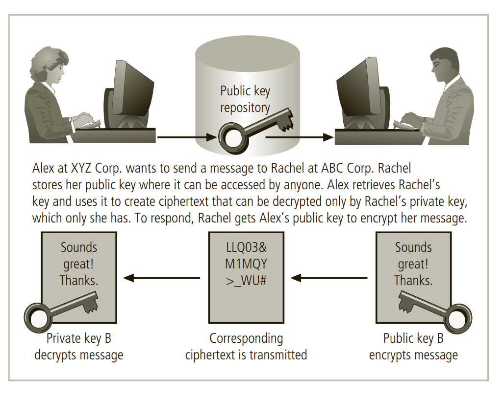

# Cryptography

### **Cryptography** 

### Introduction to Cryptography. 

The science of encryption, known as cryptology, encompasses both cryptography and cryptanalysis. Cryptography, derived from the Greek words kryptos meaning "hidden" and graphein meaning "to write," involves the creation and use of codes to secure messages. Cryptanalysis, on the other hand, deals with cracking or breaking encrypted messages to reveal their unencrypted form. Cryptography utilizes mathematical algorithms that are widely known but the protection of the encrypted message lies in the knowledge of the key, a series of characters or bits added to the algorithm along with the original message to create the encrypted message. The process of encryption transforms plaintext into ciphertext, making it unreadable to unauthorized individuals without the key to decrypt the message back into its original form. The field of cryptology is vast and this chapter provides a general overview of the subject and specific information on a few cryptographic tools. It will cover the background of cryptology, key concepts in cryptography, common cryptographic tools, cryptographic protocols and attack methods used against cryptosystems.

### Foundations of Cryptology 

The history of cryptology is extensive and multicultural, dating back thousands of years. People have been creating, using, and breaking codes for a long time, and it remains an important aspect of information security today. Many modern IT tools use embedded encryption technologies to protect sensitive information in applications. For example, web browsers use built-in encryption features to enable secure e-commerce transactions such as online banking and shopping.

Since World War II, there have been restrictions on the export of cryptosystems, and these restrictions continue today, as seen in the Code of Federal Regulations: International Traffic in Arms Regulations. These restrictions stem from the role that cryptography played in World War II, and the belief of the American and British governments that their cryptographic tools were superior to those in less developed countries. As a result, these governments believe that other countries should be prevented from using cryptosystems to communicate potential terrorist activities or gain an economic advantage.

**Terminology**

To understand the fundamentals of cryptography, you must know the meanings of the following terms:

* **Algorithm:** A mathematical formula or method used to convert plaintext (original unencrypted message) into ciphertext (encrypted message). This term can also refer to the programs that enable cryptographic processes.
* **Bit stream cipher:** An encryption method that converts plaintext to ciphertext one bit at a time.
* **Block cipher:** An encryption method that divides plaintext into blocks or sets of bits, and then converts plaintext to ciphertext one block at a time.
* **Cipher:** As a verb, it refers to the process of converting individual components of an unencrypted message into encrypted components or vice versa. As a noun, it refers to the process of encryption or the algorithm used in encryption and is synonymous with cryptosystem.
* **Ciphertext or cryptogram:** The unintelligible encrypted or encoded message resulting from encryption.
* **Code:** The process of converting components of an unencrypted message into encrypted components.
* **Decipher:** See Decryption.
* **Decryption:** The process of converting an encoded or enciphered message (ciphertext) back to its original readable form (plaintext). Also referred to as deciphering.
* **Encipher:** See Encryption.
* **Encryption:** The process of converting an original message (plaintext) into a form that cannot be used by unauthorized individuals (ciphertext). Also referred to as enciphering.
* **Key or cryptovariable:** Information used in conjunction with the algorithm to create ciphertext from plaintext. It can be a series of bits used in a mathematical algorithm or the knowledge of how to manipulate plaintext.
* **Keyspace:** The entire range of values that can be used to construct an individual key.
* **Link encryption:** A series of encryptions and decryptions between multiple systems in a network. Each system decrypts the message sent to it and then reencrypts it using different keys before sending it to the next neighbor.This process continues until the message reaches its final destination.
* **Plaintext or cleartext:** The original unencrypted message that is encrypted and is the result of successful decryption.
* **Steganography:** The practice of hiding messages, such as hiding a message within the digital encoding of a picture or graphic, making it almost impossible to detect that the hidden message even exists.
* **Work factor:** The amount of effort (usually expressed in units of time) required to perform cryptanalysis on an encoded message.

### &#x20;

### Cryptographic Algorithms & Encryption. 

Cryptographic algorithms can be divided into two main groups: symmetric and asymmetric. Symmetric algorithms use the same key for both encryption and decryption, while asymmetric algorithms use a pair of keys: a public key for encryption and a private key for decryption. In practice, many modern cryptosystems utilize a combination of both symmetric and asymmetric algorithms for enhanced security. This approach is known as a "hybrid cryptosystem".

**Symmetric Encryption**

Encryption methodologies that use the same secret key for both encryption and decryption are known as private-key or symmetric encryption. These methods are popular due to their computational efficiency, as they can be implemented using fast algorithms, even on small computers. However, one of the main challenges of symmetric key encryption is key distribution. Both the sender and the recipient must have the secret key, and if either copy of the key falls into the wrong hands, the security of the encrypted messages can be compromised. The key must be exchanged securely, using a separate communication channel or medium, to avoid interception. The primary challenge in symmetric encryption is securely sharing the key with the intended recipient.

The Data Encryption Standard (DES) is a widely used symmetric encryption cryptosystem. It was developed by IBM and is based on the company's Lucifer algorithm, which uses a key length of 128 bits. However, as implemented, DES uses a 64-bit block size and a 56-bit key. In 1976, it was adopted by the National Institute of Standards and Technology (NIST) as a federal standard for encryption of non-classified information, and it quickly gained widespread use in commercial applications. However, by 1997, it became apparent that the 56-bit key size of DES did not provide adequate security. In 1998, the Electronic Frontier Foundation (EFF) used a specialized computer to break a DES key in just over 56 hours. Since then, it has been theorized that with dedicated hardware, a DES key could be broken in less than a day. Due to these security concerns, DES is considered no longer secure and has been replaced by more advanced symmetric encryption algorithms like AES.

Triple DES (3DES) was designed to provide stronger encryption than the original Data Encryption Standard (DES). However, as computing power continued to increase, 3DES's security proved to be insufficient in the long term. As a result, it was replaced by the Advanced Encryption Standard (AES).

AES is a federal information processing standard (FIPS) that specifies a cryptographic algorithm used by the U.S. government to protect information in federal agencies that are not part of the national defense infrastructure. It was developed to replace both DES and 3DES. The AES algorithm is publicly disclosed, unclassified, and available royalty-free worldwide. Agencies that are considered a part of national defense use more secure methods of encryption provided by the National Security Agency. AES is widely considered as the standard for strong encryption, and is widely used in various industries and applications.

While 3DES remains an approved algorithm for some uses, its expected lifespan is limited. Historically, cryptographic standards approved by the Federal Information Processing Standards (FIPS) have been adopted on a voluntary basis by organizations outside government entities. The Advanced Encryption Standard (AES) was selected through a cooperative process between the U.S. government, private industry, and academia from around the world. It was approved by the Secretary of Commerce as the official federal governmental standard on May 26, 2002.

AES implements a block cipher called the Rijndael Block Cipher, which allows for a variable block length and a key length of 128, 192, or 256 bits. AES is considered to be much more secure than 3DES and other older standards. Experts estimate that it would take a specialized computer 4,698,864 quintillion years (4,698,864,000,000,000,000,000) to crack AES, making it highly resistant to brute force attacks. AES is widely used in various industries and applications as a standard for strong encryption.

>)

**Asymmetric Encryption**

Asymmetric encryption, also known as public-key encryption, uses two different but related keys to encrypt and decrypt messages. The encryption key, also known as the public key, is used to encrypt the message and the decryption key, also known as the private key, is used to decrypt the message. These two keys are mathematically related, but it is computationally infeasible to derive the private key based on the public key.

The encryption key, or public key, can be freely shared with anyone and is used to encrypt messages that are intended for the owner of the key pair. The decryption key, or private key, is kept secret and is used to decrypt the messages that were encrypted with the corresponding public key.

Asymmetric encryption can provide elegant solutions to problems of secrecy and verification. The private key is used to decrypt the message and authenticate the sender, while the public key is used to encrypt the message and verify the authenticity of the message. It is particularly useful in electronic transactions and digital signatures, where it is important to keep the private key secret and the public key accessible.

Asymmetric encryption, also known as public-key encryption, uses two different but related keys to encrypt and decrypt messages. The encryption key, also known as the public key, can be freely shared with anyone and is used to encrypt messages that are intended for the owner of the key pair. The decryption key, or private key, is kept secret and is used to decrypt the messages that were encrypted with the corresponding public key. These keys are mathematically related, but it is computationally infeasible to derive the private key based on the public key.

This technique has its greatest value when one key is used as a private key, which means it is kept secret and is known only to the owner of the key pair, and the other key serves as a public key, which means it is stored in a public location where anyone can use it. This allows for secure communication, as messages can be encrypted with the public key, but can only be decrypted with the private key. It is also used for digital signature and authentication, as the private key is used to sign a message and the public key is used to verify the signature.

Asymmetric encryption can provide elegant solutions to problems of secrecy and verification and it is a popular choice for secure electronic transactions and digital signatures.

Asymmetric encryption, also known as public-key encryption, can be used to securely send encrypted messages between two parties. In this example, Alex at XYZ Corporation wants to send an encrypted message to Rachel at ABC Corporation.

Firstly, Alex obtains Rachel’s public key from a public-key registry. The foundation of asymmetric encryption is that the same key cannot be used both to encrypt and decrypt the same message. So, when Rachel’s public key is used to encrypt the message, only her private key can be used to decrypt the message. This private key is held by Rachel alone, ensuring that only she can read the message.

Similarly, if Rachel wants to respond to Alex’s message, she goes to the registry where Alex’s public key is held and uses it to encrypt her message. This message can only be read by Alex’s private key, ensuring that only Alex can read the message.

This approach of keeping private keys secret and encouraging the sharing of public keys in reliable directories is an elegant solution to the key management problems of symmetric key applications. It provides a secure way to communicate without the need for a shared secret key, and also allows for easy verification of the sender's identity.

Asymmetric algorithms are one-way functions, meaning they are relatively easy to compute in one direction, but computationally infeasible to compute in the opposite direction. This is the foundation of public-key encryption. It relies on the use of a mathematical function, known as a one-way function, that transforms an input value into a fixed-size output value, called a hash value.

A hash value is essentially a summary of the original input values and it is virtually impossible to determine the original input values without knowing the specific algorithm used to create the hash value. This property is known as "preimage resistance"

For example, if you multiply 45 by 235, you get 10,575. This is simple enough. But if you are simply given the number 10,575, it is computationally infeasible to determine which two numbers were multiplied to produce it. This is the same concept behind the one-way functions used in asymmetric encryption, it is easy to compute the encryption but hard to compute the decryption.

One of the most widely used public-key cryptosystems is RSA, named after its developers Rivest, Shamir, and Adleman. RSA was the first public-key encryption algorithm developed and published for commercial use in 1977. Since then, it has become a widely popular and has been embedded in many web browsers to provide security for e-commerce applications. The RSA algorithm is patented, but it has become the de facto standard for public-use encryption applications. It is widely used for secure data transmission, digital signatures, and secure key exchange. RSA is considered to be one of the most secure encryption methods and is widely used in various industries and applications.

The problem with asymmetric encryption is that for each conversation between two parties, it requires four keys to be managed. When multiple organizations are involved in the conversation, it can become difficult to determine which public key should be used to encrypt a message, and managing the keys can become a complex task. Also, Asymmetric encryption is less efficient in terms of CPU computations compared to symmetric encryption. Due to these limitations, hybrid systems, such as those used in Public Key Infrastructure (PKI), are more commonly used than pure asymmetric systems. Hybrid systems use a combination of both symmetric and asymmetric encryption methods to provide a balance of security and efficiency.

**Encryption Key Size**

The key size of an encryption algorithm is an important factor in determining the strength of the encryption. The key size determines the number of possible keys that an attacker must try before finding the correct one. The longer the key, the larger the number of possible keys, and the more difficult it becomes to break the code.

As the key size increases, the number of possible keys in the key space increases exponentially, making it much more difficult for an attacker to guess the correct key through a brute force attack. For example, a key size of 128 bits provides for 2^128 possible keys, which is a very large number and would take a significant amount of time and computing power to exhaust all possibilities.

It is true that when it comes to cryptosystems, the security of encrypted data is not dependent on keeping the encrypting algorithm secret. In fact, publishing the algorithms allows for public scrutiny and research, which can help identify and address any weaknesses in the algorithm.

The security of a cryptosystem depends on keeping certain elements of the cryptovariable(s) or key(s) secret. For example, in symmetric encryption, the security of the system depends on keeping the secret key secret, while in asymmetric encryption, the security of the system depends on keeping the private key secret.

Effective security is maintained by manipulating the size (bit length) of the keys and by following proper procedures and policies for key management. This includes procedures for key generation, distribution, storage, and destruction. It is important to use a key size that is large enough to provide an acceptable level of security against potential attacks, and to follow best practices for key management to ensure the keys are not compromised.

For a simple example of how key size is related to encryption strength, consider an algorithm that uses a three-bit key. The keyspace is the range of possible keys that can be used to encrypt a message. In this case, the algorithm uses a three-bit key which can represent values from 000 to 111 in binary notation. This corresponds to the numbers 0 to 7 in decimal notation and thus provides a keyspace of eight possible keys (0-7).

Knowing the keyspace of an algorithm allows an attacker to program a computer to try all possible keys in an attempt to crack the encryption. However, this requires knowledge of the algorithm, possession of the encrypted message and a significant amount of time.

It is relatively easy to obtain encryption tools that use the Data Encryption Standard (DES) algorithm, which is a widely used standard. However, intercepting an encrypted message is illegal and can be difficult to accomplish. Additionally, cracking an encryption through a brute force attack can take a significant amount of time, especially for more advanced cryptosystems. The strength of an encryption algorithm is ultimately determined by the time it takes to guess the key. As the key size increases, it becomes more computationally infeasible to exhaust all the possible keys, making the encryption stronger.

When it comes to keys, the size of the key directly impacts the strength of the encryption. A three-bit system has eight possible keys, an eight-bit system has 256 possible keys, and a 24-bit key has almost 16.8 million possible keys. However, even with a large number of possible keys, the time it takes to crack the encryption through a brute force attack decreases as computer processing power increases.

The use of graphics processing units (GPUs) found in video cards also significantly increases the speed of cryptanalysis calculations, making it easier to crack even once-standard encryption key sizes. Additionally, using multiple computers in a grid computing environment can greatly speed up brute force key-breaking efforts.

However, it is important to note that the security of encryption is not solely dependent on the key size but also on proper key management and password management. These practices are critical in protecting encrypted information and can be even more important than key strength.

Encryption systems such as DES incorporate multiple elements or operations to increase the complexity of the encryption process and make it more difficult to crack. Using the same operation multiple times does not add any additional security, but by using a combination of different operations, the encryption becomes more secure.

For example, using a substitution cipher to replace one letter with another, then transposing the letters, and then using a XOR operation will scramble, substitute and recode the original plaintext in a way that is more difficult to break without the key. The use of multiple different operations increases the number of possible keys and makes the encryption more robust and secure.

### Cryptographic Tools. 

The ability to conceal the contents of sensitive messages and verify the contents of messages and the identities of their senders can be important in all areas of business. To be useful, these cryptographic capabilities must be embodied in tools that allow IT and information security practitioners to apply the elements of cryptography in the everyday world of computing. This section covers some of the widely used tools that bring the functions of cryptography to the world of information systems.

PKI systems play a critical role in securing e-commerce and other online transactions by providing a secure means of identifying parties and protecting the confidentiality and integrity of communications. By implementing PKI systems, organizations can safeguard sensitive information and protect against unauthorized access, tampering, and fraud.

* **Authentication:** PKI systems enable secure authentication of individuals, devices, and systems by validating digital certificates and identifying the key owners.
* **Integrity:** PKI systems ensure the integrity of messages by using digital signatures, which are created using the sender's private key, and can be verified using the sender's public key.
* **Privacy:** PKI systems provide secure communications by encrypting messages using the recipient's public key, ensuring that only the intended recipient can read the message.
* **Authorization:** The validated identity of users and programs can enable authorization rules that remain in place for the duration of a transaction; this reduces overhead and allows for more control of access privileges for specific transactions.
* **Nonrepudiation:** PKI systems enable non-repudiation of messages by providing evidence of the sender's identity and the integrity of the message.A typical PKI solution protects the transmission and reception of secure information by integrating the following components:
* A certificate authority (CA), is responsible for issuing, managing, authenticating, signing, and revoking digital certificates for users. These certificates contain information such as the user's name, public key, and other identifying details.
* A registration authority (RA), works in partnership with the CA to handle certification functions, including verifying registration information, generating end-user keys, revoking certificates, and validating user certificates.
* Certificate directories, serve as central storage locations for certificates and provide a centralized point for administration and distribution
* Management protocols are used to organize and manage communications among CAs, RAs, and end users, and include procedures for setting up new users, issuing keys, recovering keys, updating keys, revoking keys, and transferring certificates and status information within the PKI's area of authority.
* Policies and procedures,also play a role in assisting organizations in the application and management of certificates, the formalization of legal liabilities and limitations, and the actual use of certificates in business

PKI, or Public Key Infrastructure, is a system that utilizes digital certificates and a certificate authority (CA) to provide secure communication and transactions. This infrastructure enables organizations to issue digital certificates to users and servers, enroll in directories, manage key issuance, and verify and return certificates. By implementing PKI, organizations can establish an enterprise-wide solution that ensures users within the infrastructure's jurisdiction can engage in secure, authenticated communications and transactions.

In addition to these key management tasks, the CA is responsible for issuing digital certificates to users and servers. These certificates contain information such as the user's or server's identity, public key, and other identifying details. The CA uses various authentication methods to verify the identity of the user or server before issuing the certificate. Once issued, the certificate can be used to establish secure and authenticated communication between the parties involved.

The registration authority (RA) works in collaboration with the CA to handle certification functions such as verifying registration information, generating end-user keys, revoking certificates, and validating user certificates. The RA is responsible for ensuring that the correct information is provided during registration, and that only authorized users are issued certificates.

Certificate directories are central locations for storing digital certificates, providing a single access point for administration and distribution. Management protocols are used to organize and manage communications among CAs, RAs, and end-users. These protocols include procedures for setting up new users, issuing keys, recovering keys, updating keys, revoking keys, and enabling the transfer of certificates and status information among the parties involved in the PKI's area of authority.

Lastly, policies and procedures play an important role in the PKI's implementation. These policies assist organizations in the application and management of certificates, formalizing legal liabilities and limitations, and ensuring their proper use in actual business processes.

**Digital Signatures**

A digital signature is a type of electronic signature that uses a combination of encryption techniques to ensure the authenticity and integrity of a message or document. By using the sender's private key to encrypt a message, the receiver can then use the sender's public key to decrypt it and confirm that it was indeed sent by the sender. This process provides non-repudiation, which means that the sender cannot deny having sent the message. Digital signatures also provide integrity, which means that the message or document has not been tampered with during transmission. This is achieved by including a hash value of the original message in the digital signature, which can be verified by the receiver to ensure that the message has not been altered. Digital signatures are widely used in various applications such as e-commerce, e-government, and digital documents to provide a secure and reliable way to authenticate the identity of the sender and ensure the integrity of the message.

In summary, digital signatures are a form of authentication that uses asymmetric encryption to ensure that a message or document is legitimate and cannot be denied by the sender. They are created by encrypting a message digest, which is a summary of the original message, using the sender's private key. The recipient can then use the sender's public key to verify the digital signature and confirm the authenticity of the message. They are widely used to provide nonrepudiation, which is the ability to prove that a message or document was sent by a specific sender. The Digital Signature Standard (DSS) is a widely accepted standard for creating and managing digital signatures, and many products and processes that are DSS compliant have been approved and endorsed by governments for use in authenticating electronic documents.

**Digital Certificates**

As you learned earlier in this chapter, a digital certificate is an electronic document or container file that contains a key value and identifying information about the entity that controls the key. The certificate is often issued and certified by a third party, usually a certificate authority. A digital signature attached to the certificate’s container file certifies the file’s origin and integrity. This verification process often occurs when you download or update software via the Internet. For example, the window in Figure 8-8 shows that the downloaded files do come from the purported originating agency, Amazon.com, and thus can be trusted.

* Secure Sockets Layer (SSL)/Transport Layer Security (TLS) certificates are used to secure Web communications by establishing a secure connection between a web server and a web browser. This type of certificate is commonly used for e-commerce transactions, online banking, and other sensitive online activities.
* &#x20;Email signing and encryption certificates are used to sign and encrypt email messages to ensure the authenticity of the sender and the confidentiality of the message.&#x20;
* Code signing certificates are used to sign software and other code to verify the authenticity and integrity of the code, and to ensure that it has not been tampered with.
* Secure/Multipurpose Internet Mail Extensions (S/MIME) certificates are used to secure email communications by encrypting the message and verifying the identity of the sender.
* Virtual Private Network (VPN) certificates are used to authenticate the identity of a VPN client or server, and to establish a secure connection between them. Wireless certificates are used to authenticate wireless clients and to secure wireless communications.&#x20;

It is important to note that the strength of a digital certificate is dependent on the strength of the key value that is embedded in the certificate and the robustness of the certification process that is used to issue the certificate. This is why it is crucial for organizations to choose trusted and reputable CAs to issue their digital certificates, and to ensure that the key values that are embedded in the certificates are of adequate length to provide strong encryption. Proper management of digital certificates, including regular updates and revocations, is also important for maintaining the security of the certificate-based system.

On the other hand, PGP, which was developed by Phil Zimmermann in 1991, uses a web of trust model, in which users sign and verify each other's keys. This allows users to establish trust relationships with other users without the need for a central certificate authority. PGP uses a combination of symmetric and asymmetric encryption, and includes a built-in means for managing key generation, key exchange, and key revocation. It also includes a digital signature feature to enable non-repudiation. PGP is widely used for secure email, file encryption, and secure instant messaging. It is important to note that while X.509 v3 and PGP have their own set of advantages and disadvantages, both are widely used in different contexts and industries. It is essential to choose the right certificate type and certificate authority that best suits the organization's needs and requirements.

**Hybrid Cryptography Systems**

Asymmetric key encryption, while not widely used on its own, plays a crucial role in hybrid encryption systems. One of the most popular examples of this is the Diffie-Hellman key exchange. This method uses asymmetric encryption to establish a shared session key, which is then used for symmetric encryption. This hybrid approach is efficient as symmetric encryption is faster than asymmetric encryption for sending messages. The Diffie-Hellman key exchange also provides a secure way to exchange keys, eliminating the risk of third-party exposure commonly encountered in out-of-band key exchange methods. It is also considered as a foundation for the future developments in public-key encryption.

An approach that combines both symmetric and asymmetric encryption is shown in Figure 8-9. It operates as follows: when Alex from XYZ Corp wants to communicate with Rachel from ABC Corp, he first generates a session key. He then encrypts the message using this session key. Alex obtains Rachel's public key and uses it to encrypt both the session key and the already encrypted message. He sends this package to Rachel. Rachel uses her private key to decrypt the package which contains the session key and the encrypted message. She then uses the session key to decrypt the message. The session key is used for the duration of the communication session and is discarded once the session ends. Rachel can then continue to use the same session key for all electronic communications until it expires. The session key is used in more efficient symmetric encryption and decryption processes. A new session key is chosen and shared using the same process when the current session key expires, typically after a few minutes.

**Steganography**

The term steganography is derived from the Greek words "steganos" meaning "concealed" and "graphein" meaning "to write." This technique has a long history, with one of the earliest examples being described by the Greek historian Herodotus, who wrote about a Greek individual who used a secret message hidden under a wax writing tablet to warn of an impending invasion. Although steganography is not a form of cryptography, it is a method of maintaining the confidentiality of information during transmission. In contemporary times, the most prevalent form of steganography is embedding secret information within digital images or other types of files.

Steganography that involves hiding information in digital images works by manipulating the bits that make up the image file. Most image file formats use a combination of Red, Green, and Blue (RGB) values to represent each pixel in the image. Each color value typically requires 8 bits to represent its intensity, for example, 00000000 represents no red, while 11111111 represents the maximum red. This means that each pixel in an image requires 24 bits (8 bits x 3 colors) to represent its color mix and intensity. Some image file formats may use more or fewer bits per pixel. The resolution of an image, measured in pixels, is determined by the number of horizontal and vertical pixels captured when the image is created by a digital camera or computer program. For example, an image with a resolution of 1024 x 768 pixels has 786,432 pixels, or three-quarters of a megapixel. The raw image size can be calculated as 1024 x 768 x 24 bits, or 5.66 megabytes. As the image data file contains a large number of bits, it provides ample space to conceal a secret message within it.

Steganography works by manipulating the least significant bits of the image data to hide a message. To the naked eye, there is no visible difference between a pixel with a red intensity of 00101001 and a slightly different pixel with a red intensity level of 00101000. This approach allows a steganographer to use one bit of payload per color, or three bits per pixel, to encode data into an image file. For example, if a steganographic process uses three bits per pixel for all 786,432 pixels in the image, it can store up to 236 kilobytes of hidden data within the uncompressed image.

Steganographic tools can also be used to calculate the maximum amount of data that can be hidden in an image without detection. Messages can also be hidden in other types of files, such as audio and text files, by utilizing unused bits or whitespace. Some steganographic applications can hide messages in .bmp, .wav, .mp3, and .au files, as well as in unused storage space on CDs and DVDs.

Before the 9/11 terrorist attacks, U.S. federal agencies believed that terrorist organizations were using steganography to hide maps and photographs of targets and post instructions for terrorist activities in online forums and websites. However, there has not been any public proof of this activity. The Electronic Frontier Foundation (EFF) has reported that the U.S. Secret Service worked with several manufacturers of color laser printers to use steganography to encode printer serial numbers in printed documents.

### Protocol for Secure Communications. 

**(**[Amazon.com: Principles of Information Security eBook : Whitman, Michael E., Mattord, HerbertJ.:Books](https://www.amazon.com/Principles-Information-Security-Michael-Whitman-ebook/dp/B07124FYGZ/ref=sr\_1\_1?keywords=Principles+of+Information+Security\&qid=1650443715\&s=books\&sr=1-1)**)**

Many of the tools currently employed to safeguard the secrecy of data are not authentic cryptographic systems. They are, instead, programs to which cryptographic methods have been added as an extra feature. This is particularly prevalent in Internet protocols; some specialists assert that the Internet and its associated protocols were created without any regard for security, and that it was only later that security measures were implemented as an afterthought. Though it is debatable whether or not this claim holds true, the absence of security risks during the early stages of the Internet enabled it to expand rapidly. However, as the number of security threats increased, so did the need for further security measures.

**Securing Internet Communication with S-HTTP and SSL**

Securing Internet Communication with S-HTTP and SSL S-HTTP (Secure Hypertext Transfer Protocol) and SSL are protocols designed to provide secure network communication on the Internet. These protocols work in different ways and can be used independently or together. SSL (Secure Sockets Layer) was developed by Netscape to use public-key encryption to create a secure channel over the Internet. Most commonly used browsers, including Internet Explorer, support SSL. In addition to providing encryption, integrity, and server authentication, SSL can also provide client authentication when configured properly.

In April 2014, a vulnerability known as Heartbleed was discovered in a widely used implementation of the SSL protocol. Web servers affected by this vulnerability allowed attackers to bypass some of the controls that protect sensitive information. These servers used an unpatched version of the popular OpenSSL tool to implement SSL/TLS (Secure Sockets Layer/Transport Layer Security) and could be tricked into revealing the memory areas of the server. These areas might contain sensitive information such as encryption keys, passwords, or account numbers. The Heartbleed bug is classified as a buffer overread error. The OpenSSL tool is widely used on Internet sites around the world.

Soon after the vulnerability was made public, a patched version of the OpenSSL toolset was released, and most server administrators and web hosting providers were able to secure their platforms. However, unless the toolset is updated and the website purges the keys that were issued, they remain vulnerable to data loss.

The Heartbleed bug is a vulnerability in the OpenSSL library, which is a widely used implementation of the SSL (Secure Sockets Layer) protocol. The bug was caused by a feature in OpenSSL that maintained the connection between a host and a client while data was not being transmitted between them. This feature, called a heartbeat, was intended to maintain session awareness between the server and the client. However, the bug allowed the client to request data from the heartbeat packet, which would cause the server to reveal significant quantities of current server memory, including sensitive data that the server administrator would not want to be released.

The SSL protocol works by establishing a secure connection between a client and a server. When a client requests access to a portion of a website that requires secure communications, the server sends a message to the client indicating that a secure connection must be established. The client then sends its public key and security parameters to the server. The server verifies the public key and sends a digital certificate to the client to authenticate itself. Once the client verifies the certificate, the SSL session is established. Any data transmitted between the client and server during the session is encrypted.

S-HTTP (Secure Hypertext Transfer Protocol) is an extended version of the HTTP (Hypertext Transfer Protocol) that provides for the encryption of individual messages transmitted over the Internet between a client and server. S-HTTP is the application of SSL over HTTP, which allows for the encryption of all information passing between two computers through a protected and secure virtual connection. Unlike SSL, which establishes a secure channel for the duration of a session, S-HTTP is designed for sending individual messages over the Internet, so a session must be established for each exchange of data. To establish a session, the client and server must have compatible cryptosystems and agree on the configuration. The client sends its public key to the server, which generates a session key and encrypts it with the client's public key. The session key is then returned to the client, who decrypts it with their private key. Both the client and server then possess identical session keys, which they can use to encrypt messages sent between them. S-HTTP can provide confidentiality, authentication, and data integrity through a variety of trust models and cryptographic algorithms. It is designed for easy integration with existing HTTP applications and can be used in conjunction with HTTP.

**Securing E-mail with S/MIME, PEM, and PGP**

A variety of cryptosystems have been adapted to work with the most common e-mail protocols in order to provide some level of security for this often insecure means of communication. Some of the most popular adaptations include Secure Multipurpose Internet Mail Extensions (S/MIME), Privacy-Enhanced Mail (PEM), and Pretty Good Privacy (PGP).

S/MIME builds on the encoding format of the Multipurpose Internet Mail Extensions (MIME) protocol and uses digital signatures based on public-key cryptosystems to secure e-mails. PEM, which was proposed by the Internet Engineering Task Force (IETF) in 1993, uses 3DES symmetric key encryption and RSA for key exchanges and digital signatures, but it was not widely adopted. PGP, developed by Phil Zimmermann, uses the IDEA cipher for message encoding and RSA for symmetric key exchange and digital signatures.

The first commonly used Internet e-mail standard, SMTP/RFC 822 (also called SMTP), has limitations that make it difficult for organizations that need greater security and support for international character sets. MIME was developed to address the issues associated with SMTP, and it includes predefined content types and conversion transfer encodings, such as 7-bit, 8-bit, binary, and radix-64, which are used to deliver e-mails reliably across a wide range of systems.

>)

S/MIME is an extension to the Multipurpose Internet Mail Extensions (MIME) protocol and is the second generation of enhancements to the Simple Mail Transfer Protocol (SMTP) standard. S/MIME has the same message header fields as MIME, with the exception of those added to support new functionality. Like MIME, S/MIME uses a canonical form format which allows it to standardize message content type across different systems. However, S/MIME also has the additional capability to sign, encrypt and decrypt messages.

A summary of the functions and algorithms used by S/MIME is provided in Table 8-8. It's worth mentioning that PGP is functionally similar to S/MIME, incorporates some of the same algorithms, and can interoperate with S/MIME to some degree. PGP and S/MIME are two different encryption protocols that can be used to secure e-mails and both have their own unique features and use-cases.

**Securing Web Transactions with SET, SSL, and S-HTTP**

Securing Web Transactions with SET, SSL, and S-HTTP Just as PGP, PEM, and S/MIME work to secure e-mail operations, a number of related protocols work to secure web browsers, especially at e-commerce sites. Among these protocols are SET, SSL, S-HTTP, Secure Shell (SSH-2), and IP Security (IPSec). SSL and S-HTTP were discussed earlier in this chapter.

SET (Secure Electronic Transactions) was developed by MasterCard and Visa in 1997 to protect against electronic payment fraud. It uses the Data Encryption Standard (DES) to encrypt credit card information transfers and RSA for key exchange. SET provides security for both Internet-based credit card transactions and credit card swipe systems in retail stores.

SSL (Secure Sockets Layer) also provides secure online e-commerce transactions. SSL uses a number of algorithms, but mainly relies on RSA for key transfer and uses IDEA, DES, or 3DES for encrypted symmetric key-based data transfer. An example of the kind of certificate and SSL information that appears when checking out of an e-commerce site is shown in Figure 8-8. If your web connection does not automatically display such certificates, you can right-click in the browser's window and select Properties to view the connection encryption and certificate properties.

**Securing Wireless Networks with WEP and WPA**

Wireless local area networks (Wi-Fi) are considered by many in the IT industry to be inherently insecure due to the use of radio transmissions to communicate between the wireless network interface of a device and the access point providing its services. These radio signals can be intercepted by anyone with a wireless packet sniffer, making it necessary to use some form of cryptographic security control to prevent such interception.

Two sets of protocols are widely used to secure wireless transmissions: Wired Equivalent Privacy (WEP) and Wi-Fi Protected Access (WPA). Both are designed for use with the IEEE 802.11 wireless networks. WEP is an older protocol that uses a static key to encrypt data. However, it has been found to be easily cracked and is no longer considered secure. WPA, on the other hand, uses a stronger encryption algorithm and dynamic keys, making it more secure than WEP. It is important to note that even the most secure protocols are not foolproof and that regular updates and security checks are needed to maintain the security of wireless networks.

**Wired Equivalent Privacy (WEP)** was an early attempt to provide security for the 802.11 network protocol. It uses the RC4 cipher stream to encrypt packets using a 64-bit key, which is created using a 24-bit initialization vector and a 40-bit key value. The packets are formed with an XOR function to use the RC4 key value stream to encrypt the data packet and a 4-byte integrity check value (ICV) is calculated for each packet and then appended. WEP is now considered too cryptographically weak to provide any meaningful protection from eavesdropping, hence it is not recommended for use as it can be easily cracked. WPA/WPA2 are considered more secure alternatives.

WEP is considered too weak for use in most network settings for several reasons:

* Key management is not effective as most networks use a single shared secret key value for each node. Synchronizing key changes is a tedious process and no key management is defined in the protocol, so keys are seldom changed.&#x20;
* The initialization vector (IV) is too small, resulting in the recycling of IVs. An attacker can reverse-engineer the RC4 cipher stream and decrypt subsequent packets, or can forge future packets. In 2007, a brute force decryption was accomplished in less than one minute.
* An intruder who collects enough data can threaten a WEP network in just a few minutes by decrypting or altering the data being transmitted, or by forging the WEP key to gain unauthorized access to the network. WEP also lacks a means of validating user credentials to ensure that only authorized network users are allowed to access it. It is important to note that WEP is considered an insecure protocol, and it is not recommended to use it for any new deployments or updates.

**Wi-Fi Protected Access (WPA and WPA2)** were created to resolve the security issues with WEP. WPA uses a key size of 128 bits and dynamic keys created and shared by an authentication server through the use of the Temporal Key Integrity Protocol (TKIP). TKIP is a suite of algorithms designed to work with legacy networking devices and to deliver the best security possible given the constraints of the wireless network environment. TKIP adds four new algorithms in addition to those that were used in WEP:

* A cryptographic message integrity code (MIC), called Michael, to defeat forgeries
* A new IV sequencing discipline to remove replay attacks
* A per-packet key mixing function to decorrelate the public IVs from weak keys
* A rekeying mechanism to provide fresh encryption and integrity keys, undoing the threat of attacks stemming from key reuse&#x20;

WPA2 was made available as a replacement for WPA in 2004, it provided many of the elements missing from WPA, most notably AES-based encryption. WPA2 became mandatory for all new Wi-Fi devices in 2006. WPA2 is backward-compatible with WPA, but some older network cards may have difficulty using it. Table 8-9 provides a summary of the differences between WEP and WPA. WPA2 is considered a more secure protocol than WPA and WEP, it is recommended to use it for any new deployments or updates.

**Next Generation Wireless Protocols Robust Secure Network** RSN provides robust security features such as key management, data integrity, and data encryption, which makes it a more secure option than WEP or WPA for wireless networks. Additionally, RSN is backward-compatible with TSN, which allows it to coexist with older wireless devices that may not support AES-CCMP. However, it is important to note that for optimal security, it is recommended to phase out older wireless devices that only support WEP or WPA and upgrade to newer devices that support RSN or its successor protocols.

Note, however, that a WLAN on which devices still use WEP is not optimally secured.

The RSN protocol functions as follows:

* The wireless network interface card (NIC) sends a probe request.
* The wireless access point sends a probe response with an RSN Information Exchange (IE) frame.
* The wireless NIC requests authentication via one of the approved methods.
* The wireless access point provides authentication for the wireless NIC.
* The wireless NIC sends an association request with an RSN IE frame.
* The wireless access point sends an association response.

**Bluetooth** is a wireless technology that allows devices to communicate with each other over short distances. It is commonly used in devices such as phones, laptops, and other portable devices. However, Bluetooth has security risks, as it operates on radio frequencies that can be intercepted by anyone within a range of 30 feet. By default, Bluetooth does not authenticate connections, and devices can easily be accessed in discoverable mode. To improve security, devices can be set to non-discoverable mode, and users can require a passkey for paired devices. Additionally, users should turn off Bluetooth when not in use and be cautious about accepting incoming communications pairing requests from unknown sources. In summary, Bluetooth security can be improved by careful usage and configuration of the device.

**Securing TCP/IP with IPSec and PGP**

IPSec is a protocol that provides security for IP-based networks by protecting data integrity, user confidentiality, and authenticity at the packet level. It is widely used to create VPNs and is an open-source framework. It operates in two modes: transport and tunnel, and includes the IP Security protocol and the Internet Key Exchange for key exchange and negotiation of security associations. It is defined in several Request for Comments (RFCs) and is considered a standard for securing communications on IP-based networks.

Pretty Good Privacy (PGP) is another popular tool for securing e-mail communication. Developed by Phil Zimmermann in 1991, PGP uses a combination of symmetric and asymmetric encryption to secure e-mails. PGP uses the RSA algorithm for key exchange and digital signatures and IDEA, CAST or AES for message encryption. PGP also includes a mechanism for encrypting the subject line of an e-mail to prevent the subject from being read by an eavesdropper. PGP is often used to encrypt and sign e-mails, as well as to encrypt files and disk partitions. PGP is available as a commercial product as well as a free and open-source software. It can be used with most e-mail clients and can also be integrated with other security tools such as VPNs to provide a more secure communication infrastructure.

IPSec uses several different cryptosystems:

* Diffie-Hellman key exchange for deriving key material between peers on a public network
* Public-key cryptography for signing the Diffie-Hellman exchanges to guarantee the identity of the two parties
* Bulk encryption algorithms, such as DES, for encrypting the data
* Digital certificates signed by a certificate authority to act as digital ID cards

IPSec is a security protocol that is used to secure communications across IP-based networks such as LANs, WANs, and the Internet. It operates in two modes, transport mode and tunnel mode, and uses two protocols, the application header (AH) and the encapsulating security payload (ESP) protocols. The AH protocol provides system-to-system authentication and data integrity verification, while the ESP protocol provides secrecy for the contents of network communications as well as system-to-system authentication and data integrity verification. IPSec is widely used to create virtual private networks (VPNs) and is an open-source framework defined by the IETF.

The ESP protocol is designed to provide confidentiality, data integrity, and IP packet authentication. ESP provides these security features through the use of encryption algorithms, such as AES and 3DES, and a message integrity check algorithm, such as HMAC. ESP can be used in either transport mode or tunnel mode, depending on the network requirements. In transport mode, only the payload of the IP packet is encrypted, while in tunnel mode, the entire inner IP packet is encrypted. ESP can also be used in combination with the AH protocol to provide both confidentiality and authentication for IP packets. The ESP protocol also includes a security parameters index (SPI) to reference the session key and algorithm used to protect the data, as well as a sequence number to prevent replay attacks.

IPSec is a framework that provides security for IP-based networks by using the AH and ESP protocols. The AH protocol provides data integrity and IP packet authentication but does not provide confidentiality protection. The ESP protocol, on the other hand, provides confidentiality services for IP packets across insecure networks, and can also provide the authentication services of AH. It is widely used to create virtual private networks (VPNs) and can operate in both transport and tunnel mode. ESP supports several encryption algorithms such as DES, Triple DES, IDEA, RC5, CAST, and Blowfish.
